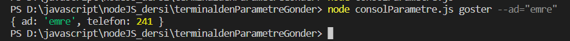

# ***NODEJS TERMİNALDEN PARAMETRE GÖNDERME***

  

<b>-> Bu proje terminalken kişi bilgisini gönderip kisiler üzerinde işlem yapmayı sağlar. </b>
  

-> Bu proje NODEJS ile yapılmıştır.. 
-> Kişi bilgisi ve yapılmak istenen işlem terminal üzerinden gönderilir ! 
-> Kişi ekleme,listeleme ,silme ve gösterme işlemleri yapılabilmektedir!
 

 
 

    <h6>Ana Sayfa:</h6> 
      

